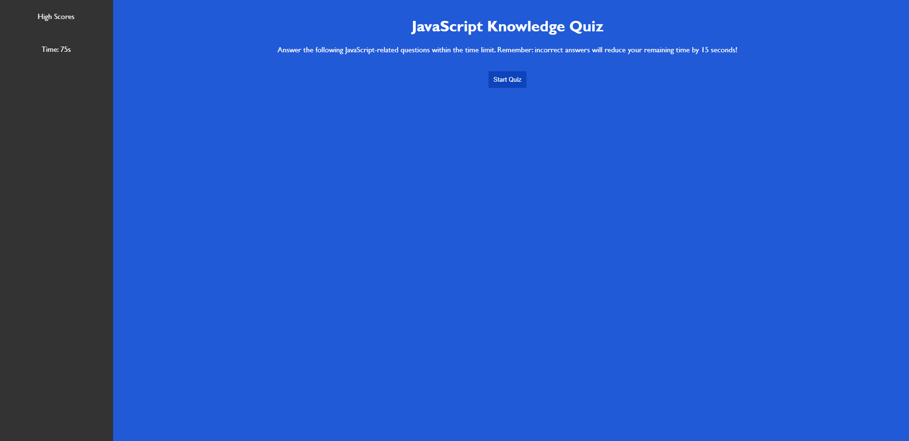

# JavaScript Fundamentals Timed Quiz

## Description

This project was to make a timed quiz, on the fundamentals of JavaScript. The  This quiz is on JavaScript  This project consists of quiz will start a countdown timer when the start button is clicked. After being prompted to answer different questions, the score will be displayed on the screen. If an answer is incorrect, 15 seconds will be deducted from the score. The quiz will end when the timer hits when all the questions are answered, or the timer has reached 0. After the game is over you can save your score by registering it with your initials. You can then view the leaderboard to see the highest scores.

## Installation

N/A

## Usage

To use this page, start the quiz by pressing the start button. Answer the questions the best you can, keep in mind there is a timer counting down from 75 seconds. If your answer is wrong, you will be deducted 15 seconds from the timer. After you have answered all the questions or the timer has run out, you will see your score which will be the time left. Save your score by entering your initials and clicking submit. You can Go Back to the start or clear the highscores by clicking the relevant buttons. 

## Credits

- Lots of internet Resources
- Teachers/Class Material

## License 

N/A

## GitHub Repository

[GitHub Repository](https://github.com/HarryP-GitHub/JavaScript-Fundamentals-Timed-Quiz)

## Deployed Website link

[Deployed Website](https://harryp-github.github.io/JavaScript-Fundamentals-Timed-Quiz/)

## Deployed Website image

